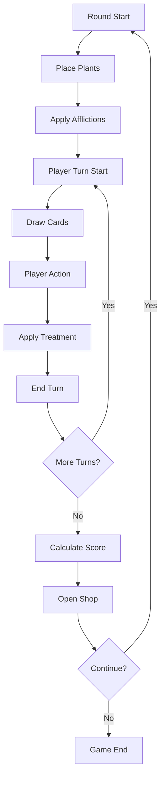
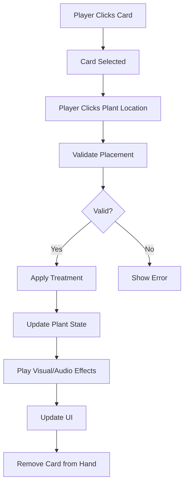
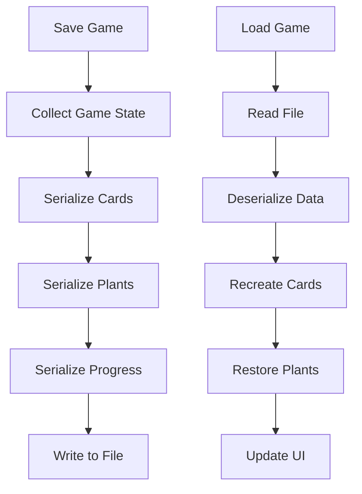

# Horticulture - System Architecture

This document provides a comprehensive overview of the Horticulture game's technical architecture, design patterns, and system interactions. It serves as a guide for developers working on the project and those seeking to understand the system's structure.

## Table of Contents

1. [Architectural Overview](#architectural-overview)
2. [Design Patterns](#design-patterns)
3. [System Components](#system-components)
4. [Data Flow](#data-flow)
5. [Persistence Architecture](#persistence-architecture)
6. [Event System](#event-system)
7. [Performance Considerations](#performance-considerations)
8. [Extensibility](#extensibility)
9. [Dependencies](#dependencies)

## Architectural Overview

### High-Level Architecture

Horticulture follows a **layered architecture** with **component-based design**, leveraging Unity's GameObject/Component system while maintaining clear separation of concerns.

```
┌─────────────────────────────────────────┐
│               Presentation Layer        │
│  ┌─────────────┐  ┌─────────────────────┐│
│  │ UI Systems  │  │ Visual Effects      ││
│  │ - CardView  │  │ - Particles        ││
│  │ - Click3D   │  │ - Shaders          ││
│  │ - Menus     │  │ - Animations       ││
│  └─────────────┘  └─────────────────────┘│
└─────────────────────────────────────────┘
┌─────────────────────────────────────────┐
│              Business Logic Layer       │
│  ┌─────────────┐  ┌─────────────────────┐│
│  │ Card Core   │  │ Plant Management    ││
│  │ - Game Flow │  │ - Health Tracking   ││
│  │ - Scoring   │  │ - Afflictions       ││
│  │ - Shop      │  │ - Treatments        ││
│  └─────────────┘  └─────────────────────┘│
└─────────────────────────────────────────┘
┌─────────────────────────────────────────┐
│               Data Layer                │
│  ┌─────────────┐  ┌─────────────────────┐│
│  │ Game State  │  │ Configuration       ││
│  │ - Save/Load │  │ - ScriptableObjects ││
│  │ - Serializ. │  │ - Constants         ││
│  └─────────────┘  └─────────────────────┘│
└─────────────────────────────────────────┘
```

### Core Architectural Principles

1. **Separation of Concerns**: Each system has a clear, single responsibility
2. **Loose Coupling**: Systems communicate through well-defined interfaces
3. **High Cohesion**: Related functionality is grouped together
4. **Extensibility**: New cards, treatments, and features can be added easily
5. **Testability**: Business logic is separated from Unity dependencies where possible
6. **Resilience**: Watchdog systems prevent permanent failure states

## Design Patterns

### Singleton Pattern

**Usage**: Central system access points
- `CardGameMaster` - Global game state coordinator
- Static access to scoring and turn management

```csharp
public class CardGameMaster : MonoBehaviour
{
    public static CardGameMaster Instance { get; private set; }

    private void Awake()
    {
        if (Instance == null)
        {
            Instance = this;
            DontDestroyOnLoad(gameObject);
        }
        else
        {
            Destroy(gameObject);
        }
    }
}
```

**Benefits**:
- Centralized access to core systems
- Prevents multiple instances of critical systems
- Simplified inter-system communication

**Drawbacks**:
- Can create tight coupling if overused
- Difficult to unit test in isolation
- Hidden dependencies

### Component Pattern (Unity's GameObject System)

**Usage**: All game entities are composed of components
- Plants have `PlantController`, `PlantCardFunctions`, `PlantHealthBarHandler`
- Cards have `CardView`, `Click3D` components
- UI elements have interaction and display components

```csharp
// Plant composition
public class PlantController : MonoBehaviour
{
    // Health and affliction management
}

public class PlantCardFunctions : MonoBehaviour
{
    // Card-specific functionality
}

public class PlantHealthBarHandler : MonoBehaviour
{
    // Visual health representation
}
```

**Benefits**:
- Flexible entity composition
- Code reusability across different entity types
- Clear separation of functionality
- Unity Editor integration

### Strategy Pattern

**Usage**: Card behavior and treatment application
- Different treatment strategies for different afflictions
- Card types with varying behaviors

```csharp
public interface ITreatment
{
    void ApplyTreatment(PlantController plant);
    string Description { get; }
}

public class HorticulturalOilTreatment : ITreatment
{
    public void ApplyTreatment(PlantController plant)
    {
        // Specific treatment logic for horticultural oil
    }
}
```

**Benefits**:
- Easy to add new treatment types
- Treatment logic is encapsulated
- Runtime strategy selection

### Observer Pattern

**Usage**: Event-driven communication between systems
- Turn progression events
- Card selection events
- Plant state changes

```csharp
public static event System.Action<PlantController> OnPlantAfflicted;
public static event System.Action<int> OnTurnEnd;

// Usage
OnTurnEnd?.Invoke(currentTurn);
```

**Benefits**:
- Decoupled communication
- Multiple systems can respond to events
- Easy to add new event listeners

### Factory Pattern

**Usage**: Card creation and instantiation
- Card cloning system
- Treatment instantiation

```csharp
public static class CardFactory
{
    public static ICard CreateCard(string cardTypeName)
    {
        return cardTypeName switch
        {
            "ColeusCard" => new ColeusCard(),
            "HorticulturalOilBasic" => new HorticulturalOilBasic(),
            _ => throw new ArgumentException($"Unknown card type: {cardTypeName}")
        };
    }
}
```

**Benefits**:
- Centralized object creation
- Easy to modify creation logic
- Supports serialization/deserialization

### Watchdog Pattern

**Usage**: Animation timeout detection and recovery
- DOTween sequence monitoring in `DeckManager`
- UI deadlock prevention
- Automatic recovery from stuck states

```csharp
// Start watchdog when animation begins
UpdatingActionDisplay = true;
StartCoroutine(AnimationTimeoutWatchdog(5f));

// Watchdog monitors for timeout
private IEnumerator AnimationTimeoutWatchdog(float maxDuration)
{
    yield return new WaitForSeconds(maxDuration);
    if (UpdatingActionDisplay)
    {
        Debug.LogError("Animation timeout detected!");
        ForceResetAnimationFlag();
    }
}

// Force recovery when timeout detected
public void ForceResetAnimationFlag()
{
    SafeKillSequence(ref _currentHandSequence);
    UpdatingActionDisplay = false;
    // Re-enable disabled components
}
```

**Benefits**:
- Prevents permanent UI deadlocks
- Automatic recovery from animation failures
- Improved user experience and robustness
- Diagnostic logging for debugging

**Use Cases**:
- DOTween animation sequences
- Async operations with timeouts
- Long-running coroutines
- UI state management

**See Also**: [animation-timeout-system.md](animation-timeout-system.md) for detailed implementation

### Wrapper Pattern

**Usage**: PlantHolder wraps Transform with caching and convenience API
- Component caching for performance
- Semantic clarity (plant location vs generic Transform)
- Backward compatibility via implicit operators

```csharp
[Serializable]
public class PlantHolder
{
    [SerializeField] private Transform plantLocation;
    [SerializeField] private List<PlacedCardHolder> placedCardHolders;

    public Transform Transform => plantLocation;
    public Vector3 Position => plantLocation.position;
    public IReadOnlyList<PlacedCardHolder> CardHolders => placedCardHolders;

    public void InitializeCardHolders()
    {
        placedCardHolders = plantLocation.GetComponentsInChildren<PlacedCardHolder>().ToList();
    }

    // Implicit conversion for backward compatibility
    public static implicit operator Transform(PlantHolder holder) => holder?.plantLocation;
    public static implicit operator bool(PlantHolder holder) => holder?.plantLocation;
}
```

**Benefits**:
- Performance: Pre-caches child components (eliminates O(n) GetComponentsInChildren calls)
- Semantic clarity: Explicit "plant location" type vs generic Transform
- Backward compatibility: Implicit operators minimize refactoring
- Extensibility: Centralized location for plant location logic

**Usage Pattern**:
```csharp
// DeckManager maintains list of PlantHolders
public List<PlantHolder> plantLocations;

// Access cached components without GetComponent call
foreach (var holder in plantLocations)
{
    var cardHolders = holder.CardHolders; // O(1) cached access
    var position = holder.Position;       // Convenient property
}
```

**See Also**: [plant-holder-system.md](plant-holder-system.md) for detailed documentation

## System Components

### Card Game System

**Primary Components**:
- `CardGameMaster`: Central coordinator
- `DeckManager`: Card operations and plant management
- `TurnController`: Game flow and progression
- `ScoreManager`: Economy and scoring
- `ShopManager`: Card acquisition
- `PlantHolder`: Plant location wrapper with component caching

**Responsibilities**:
- Turn-based game flow management
- Card hand and deck operations
- Plant placement and removal
- Economic calculations and scoring
- Treatment application coordination
- Animation sequence management with timeout protection

**Key Interfaces**:
```csharp
public interface ICard
{
    string Name { get; }
    int? Value { get; set; }
    ICard Clone();
}

public enum PlantCardCategory
{
    Fruiting,
    Decorative,
    Other
}

public interface IPlantCard : ICard
{
    InfectLevel Infect { get; }
    int EggLevel { get; set; }
    PlantCardCategory Category { get; }
}
```

Plant cards now expose `PlantCardCategory` so consumers can distinguish Fruiting versus Decorative cards (and add new categories later).

### Game Economy System

**Price Boost Mechanism**:
The game implements a dynamic pricing system to add variety and strategic depth to each level. At the start of each level, the system randomly selects:
- One plant category (Fruiting or Decorative)
- A base boost amount (+$2 to +$4)
- Applies a difficulty multiplier based on current level

This boost is applied to all plant cards of the selected category when they are placed on the board during that level.

**Difficulty Scaling**:
To keep the game challenging but playable as rent increases, the price boost scales with level difficulty:

**Formula**: `modifier = 1 + (level - 1) / 2`

| Level | Rent | Modifier | Boost Range | Example Boosted Value* |
|-------|------|----------|-------------|------------------------|
| 1     | $100 | 1x       | $2-4        | $6-12                  |
| 2     | $100 | 1x       | $2-4        | $6-12                  |
| 3     | $150 | 2x       | $4-8        | $8-16                  |
| 5     | $250 | 3x       | $6-12       | $10-20                 |
| 10    | $500 | 5x       | $10-20      | $14-28                 |
| 20    | $1000| 10x      | $20-40      | $24-48                 |

*Boosted plant value = base value ($4-8) + scaled boost

This scaling keeps pace with rent increases (+$50/level starting at level 3), maintaining game balance across difficulty levels.

**Implementation**:
- `DeckManager.CalculatePriceBoostModifier()`: Calculates difficulty multiplier based on level
- `DeckManager.GeneratePlantPrices()`: Called at level start to select category and scaled amount
- Static fields `_boostedCategory` and `_priceBoostAmount` store the selection
- `DeckManager.ApplyStoredPriceBoost()`: Called automatically during plant placement via `PrepareNextRound()`
- Price boosts persist for the entire level but reset between levels (cards regenerated from prototypes)

**Design Rationale**:
- Encourages players to adapt strategy based on which plants have higher value
- Adds replayability through randomized economic conditions
- Rewards players who diversify their plant portfolio
- Teaches market dynamics and opportunity cost
- Scales difficulty to prevent economic impossibility at high levels

### Plant Management System

**Primary Components**:
- `PlantController`: Individual plant behavior
- `PlantManager`: Collection management
- `PlantHealthBarHandler`: Visual health representation
- `PlantHolder`: Location wrapper with cached card holders

**Responsibilities**:
- Plant health and state tracking
- Affliction and treatment application
- Visual effect coordination
- Death/removal processing
- Component caching for performance

**Data Structures**:
```csharp
public class InfectLevel
{
    private Dictionary<string, (int infect, int eggs)> _sources;
    public int InfectTotal => _sources.Values.Sum(v => v.infect);
    public int EggTotal => _sources.Values.Sum(v => v.eggs);
}
```

**PlantHolder Caching**:
```csharp
// Before: Multiple GetComponentsInChildren calls
var cardHolders = plantLocation.GetComponentsInChildren<PlacedCardHolder>();

// After: O(1) cached access
var cardHolders = plantHolder.CardHolders;
```

### Game State System

**Primary Components**:
- `GameStateManager`: Serialization coordination
- `GameStateData`: Data structure definitions

**Responsibilities**:
- Complete game state serialization
- Save/load functionality
- Data persistence across sessions
- Version compatibility management

**Serialization Strategy**:
- JSON-based serialization for human readability
- Hierarchical data structures for organization
- Type name storage for polymorphic deserialization

### User Interface System

**Primary Components**:
- `CardView`: Card visual representation
- `Click3D`: 3D interaction handling
- `PlacedCardHolder`: Card placement management
- Various UI controllers for menus and displays

**Responsibilities**:
- User input handling
- Visual feedback and animations
- Menu navigation
- Game state visualization
- Animation timeout protection

### Audio System

**Primary Components**:
- `SoundSystemMaster`: Audio coordination
- Per-component audio sources

**Responsibilities**:
- Sound effect playback
- Audio source management
- Context-sensitive audio selection

### Animation Management System

**Primary Components**:
- DOTween sequence management in `DeckManager`
- Animation timeout watchdog coroutines
- Force-reset recovery mechanisms

**Responsibilities**:
- Card hand animation sequences
- Animation state tracking
- Timeout detection and recovery
- Memory leak prevention

**Key Features**:
- Watchdog pattern prevents permanent UI deadlocks
- Automatic recovery from failed animations
- Diagnostic logging for debugging
- Component re-enablement after recovery

**See**: [animation-timeout-system.md](animation-timeout-system.md) for implementation details

## Data Flow

### Game Round Data Flow



### Card Selection and Application Flow



### Save/Load Data Flow



## Persistence Architecture

### Save Data Structure

```json
{
  "turnData": {
    "currentTurn": 2,
    "currentRound": 1,
    "turnCount": 4,
    "canClickEnd": true
  },
  "scoreData": {
    "money": 45
  },
  "deckData": {
    "actionDeck": [...],
    "actionHand": [...],
    "discardPile": [...]
  },
  "plants": [
    {
      "plantType": "Coleus",
      "locationIndex": 0,
      "currentAfflictions": ["Aphids"],
      "moldIntensity": 0.0
    }
  ],
  "retainedCard": {
    "card": {...},
    "hasPaidForCard": true
  }
}
```

### Serialization Strategy

**Card Serialization**:
- Store type names for polymorphic reconstruction
- Preserve sticker modifications
- Handle nullable values appropriately

**Plant State Serialization**:
- Track all affliction history for immunity system
- Store visual state (mold intensity, etc.)
- Preserve treatment application history

**Version Compatibility**:
- Data structure versioning for future updates
- Graceful handling of missing fields
- Migration strategies for save file updates

## Event System

### Core Events

```csharp
// Turn Management Events
public static event Action<int> OnTurnStart;
public static event Action<int> OnTurnEnd;
public static event Action<int> OnRoundStart;
public static event Action<int> OnRoundEnd;

// Card Events
public static event Action<ICard> OnCardSelected;
public static event Action<ICard> OnCardPlaced;
public static event Action<ICard> OnCardDiscarded;

// Plant Events
public static event Action<PlantController> OnPlantPlaced;
public static event Action<PlantController> OnPlantRemoved;
public static event Action<PlantController, IAffliction> OnAfflictionAdded;
public static event Action<PlantController, ITreatment> OnTreatmentApplied;

// Game State Events
public static event Action OnGameSaved;
public static event Action OnGameLoaded;
```

### Event Usage Patterns

**Publisher Pattern**:
```csharp
public class TurnController : MonoBehaviour
{
    public void EndTurn()
    {
        // Process turn logic
        OnTurnEnd?.Invoke(currentTurn);
    }
}
```

**Subscriber Pattern**:
```csharp
public class ScoreManager : MonoBehaviour
{
    private void OnEnable()
    {
        TurnController.OnTurnEnd += CalculateScore;
    }

    private void OnDisable()
    {
        TurnController.OnTurnEnd -= CalculateScore;
    }
}
```

## Performance Considerations

### Memory Management

**Object Pooling**:
- Card GameObjects reused rather than created/destroyed
- Particle systems pooled for plant effects
- UI element reuse for dynamic content

**Garbage Collection Minimization**:
- Cached references to frequently accessed components (PlantHolder.CardHolders)
- Struct usage for small data types where appropriate
- String concatenation optimization

**Animation Sequence Cleanup**:
- DOTween sequences properly killed to prevent memory leaks
- References nulled after cleanup via SafeKillSequence()
- Watchdog coroutines clean up on timeout

### Processing Optimization

**Batch Operations**:
- All plants processed together during turn transitions
- Affliction spreading calculated in single pass
- UI updates batched to reduce render calls

**Lazy Evaluation**:
- Shader updates only when plant state changes
- Score calculations only when needed
- Visual effects only created when triggered

**Component Caching**:
- PlantHolder pre-caches PlacedCardHolder components
- Eliminates repeated GetComponentsInChildren calls
- O(1) access to cached components vs O(n) hierarchy traversal

### Asset Management

**Resource Loading**:
- Materials loaded from Resources on demand
- Prefabs instantiated as needed
- Audio clips cached in memory for quick access

**Scene Management**:
- Single persistent scene with dynamic content
- Components enabled/disabled rather than created/destroyed
- State preserved across game sessions

## Extensibility

### Adding New Card Types

1. **Create Card Class**:
```csharp
public class NewTreatmentCard : ICard
{
    public string Name => "New Treatment";
    public ITreatment Treatment => new NewTreatmentLogic();
    public ICard Clone() => new NewTreatmentCard();
}
```

2. **Implement Treatment Logic**:
```csharp
public class NewTreatmentLogic : ITreatment
{
    public void ApplyTreatment(PlantController plant)
    {
        // Custom treatment logic
    }
}
```

3. **Add to Factory**:
Update card creation logic to handle new type

4. **Create Visual Assets**:
Add materials and prefabs for visual representation

### Adding New Game Mechanics

**Location Cards Example**:
- Extend ICard with ILocationCard interface
- Add location-specific data to save system
- Implement persistent effect system
- Update UI to show location card slots

**New Plant Types**:
- Add to PlantType enumeration
- Create plant-specific card class
- Add visual prefab and materials
- Update tutorial and documentation

### Plugin Architecture

**Modding Support** (Future):
- ScriptableObject-based card definitions
- JSON configuration for game parameters
- Event-driven system allows external logic injection
- Interface-based design supports runtime implementations

## Dependencies

### Unity Packages

**Core Dependencies**:
- Unity 6000.1.11f1+
- Universal Render Pipeline (URP)
- Unity Input System
- Unity Test Framework

**Third-Party Assets**:
- DOTween Pro (Animation system)
- Unity Analytics (Telemetry)
- TextMeshPro (Text rendering)

### External Libraries

**Serialization**:
- Unity's JsonUtility for save data
- System.Text.Json consideration for future updates

**Audio**:
- Unity's built-in audio system
- No external audio libraries required

### Platform Dependencies

**Desktop**:
- .NET Framework 4.x compatibility
- DirectX 11+ or equivalent graphics
- File system access for saves

**Mobile** (Future):
- Platform-specific save locations
- Touch input adaptations
- Performance optimizations for mobile GPUs

## Architectural Evolution

### Current State (Version 1.0)

- Component-based card game system
- File-based save system
- Single-scene architecture
- Watchdog-protected animations
- PlantHolder wrapper pattern for performance

### Planned Improvements (Version 2.0)

**Microservices Approach**:
- Break CardGameMaster into smaller, focused services
- Event-driven communication between services
- Dependency injection for better testability

**Enhanced Persistence**:
- Cloud save synchronization
- Multiple save slots
- Automatic backup system

**Performance Enhancements**:
- ECS (Entity Component System) migration consideration
- Compute shader integration for complex calculations
- Addressable assets for better memory management

### Long-term Vision (Version 3.0+)

**Multiplayer Architecture**:
- Server-authoritative game state
- Real-time collaboration features
- Competitive modes

**AI Integration**:
- Machine learning for adaptive difficulty
- AI opponent implementation
- Procedural content generation

---

## Conclusion

The Horticulture architecture balances educational game requirements with maintainable, extensible code design. The component-based approach allows for flexible entity composition while maintaining clear separation of concerns.

Key architectural strengths:
- **Modularity**: Systems can be developed and tested independently
- **Extensibility**: New content can be added without major refactoring
- **Maintainability**: Clear interfaces and documentation support long-term development
- **Performance**: Optimizations focus on the most impactful areas (component caching, animation management)
- **Resilience**: Watchdog systems prevent permanent failure states

Areas for future improvement:
- **Testing**: Increase unit test coverage of business logic
- **Decoupling**: Reduce singleton usage where possible
- **Performance**: Profile and optimize for mobile platforms
- **Modularity**: Consider plugin architecture for user-generated content

This architecture provides a solid foundation for the current educational game while supporting future enhancements and platform expansion.

## Related Documentation

- [plant-holder-system.md](plant-holder-system.md) - PlantHolder wrapper pattern details
- [animation-timeout-system.md](animation-timeout-system.md) - Watchdog pattern implementation
- [card-core-system.md](card-core-system.md) - Card Core system architecture
- [plant-holder-migration-solution.md](plant-holder-migration-solution.md) - Migration guide for PlantHolder
